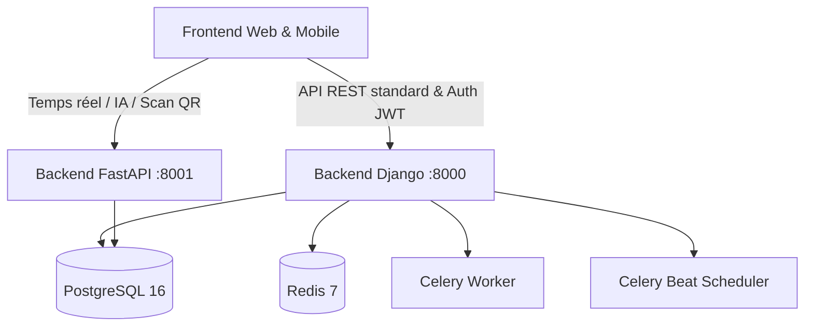

# 📊 Rapport d'Analyse Technique du Backend ANITCHE

> **Projet** : Plateforme ANITCHE  
> **Date d'analyse** : Août 2026  
> **Branche analysée** : `backend-django` (commit `85b423d`)  
> **Architecture** : Hybride Django 6.0 REST Framework (Core métier) + FastAPI (Services temps réel / IA) + PostgreSQL 16 + Redis 7 + Celery

---

## 1. Vue d'Ensemble de l'Architecture

Le backend du projet **ANITCHE** est articulé autour de deux briques complémentaires :



1. **`backend-django`** : Cœur relationnel et transactionnel de la plateforme. Gère l'authentification sécurisée, les permissions fines par rôle, la gestion des boutiques, le catalogue, les paniers, le support et l'ensemble de la logique métier critique.
2. **`backend-fastapi`** : Microservice asynchrone conçu pour la haute performance et les interactions temps réel (conseiller IA, moteur de recherche vectorielle/sémantique, scan de passeports QR, suivi de livraison en temps réel).
3. **`infra`** : Environnement complet conteneurisé Docker Compose orchestrant Django, FastAPI, PostgreSQL 16, Redis 7, Celery Worker, Celery Beat et le frontend React/Vite.

---

## 2. État d'Avancement des Modules Django (`apps/`)

Le projet est découpé en **12 applications modulaires** dans le dossier `backend-django/apps/`.

| Module (`app`) | Statut | Description & Fonctionnalités Clés |
| :--- | :---: | :--- |
| **`utilisateurs`** | ✅ **Terminé** | Modèle `Utilisateur` personnalisé, rôles (7 types), flux KYC complet, système OTP sécurisé (hachage), authentification JWT SimpleJWT, réinitialisation de mot de passe, tâches Celery. |
| **`vendeurs`** | ✅ **Terminé** | Modèle `Boutique`, validation administrative KYC, modèle proxy `DemandeVendeur`, services transactionnels stricts, permissions par rôle, 11 endpoints d'API. |
| **`support`** | ✅ **Terminé** | Système de tickets (`SupportTicket`), messages chronologiques (`TicketMessage`), pièces jointes (`TicketAttachment`), notes internes staff, visibilité granulaire par rôle. |
| **`panier`** | ✅ **Terminé** | Gestion du panier unifié (`Panier`, `PanierItem`) prenant en charge les visiteurs anonymes (session) et les utilisateurs connectés. |
| **`catalogue`** | ⏳ *Squelette* | Prochaine brique à implémenter (produits, variantes, catégories, stock) — point d'accroche prêt vers `vendeurs.Boutique`. |
| **`notifications`** | ⏳ *Squelette* | Points d'accroche déjà identifiés (envoi SMS/Email OTP, notifications validation/refus KYC). |
| **`commandes`** | ⏳ *Squelette* | En attente de finalisation du catalogue et du panier. |
| **`paiements`** | ⏳ *Squelette* | En attente (Mobile Money, cartes bancaires). |
| **`livraison`** | ⏳ *Squelette* | En attente (gestion des livreurs et courses). |
| **`retours`** | ⏳ *Squelette* | En attente. |
| **`fidelite`** | ⏳ *Squelette* | En attente (points, récompenses). |
| **`passeport_qr`**| ⏳ *Squelette* | En attente (traçabilité produit). |

---

## 3. Analyse Détaillée des Modules Implémentés

### 🔐 1. Module `utilisateurs`

* **Fichiers principaux** :
  - [`models.py`](file:///c:/Users/Jordan/Documents/Anitche/backend-django/apps/utilisateurs/models.py) :
    - `Role` : `client`, `vendeur`, `livreur`, `moderateur`, `support`, `admin`, `super_admin`.
    - `StatutKYC` : `non_soumis`, `en_attente`, `valide`, `refuse`.
    - `Utilisateur` : Authentification sur `email`, gestion des vérifications téléphone/email.
    - `DocumentKYC` : Pièces d'identité, selfies, justificatifs et comptes Mobile Money / bancaires.
    - `CodeOTP` : Codes à 6 chiffres temporaires (10 min, 5 tentatives max), stockés sous forme de hash (`make_password`) pour prévenir toute fuite en clair.
  - [`tasks.py`](file:///c:/Users/Jordan/Documents/Anitche/backend-django/apps/utilisateurs/tasks.py) : Tâche Celery `nettoyer_otp_expires` pour la maintenance périodique.
  - [`urls.py`](file:///c:/Users/Jordan/Documents/Anitche/backend-django/apps/utilisateurs/urls.py) :
    - `POST /api/utilisateurs/inscription/`
    - `POST /api/utilisateurs/connexion/` & `/connexion/rafraichir/` (JWT SimpleJWT)
    - `GET/PUT/PATCH /api/utilisateurs/profil/`
    - `POST /api/utilisateurs/changement-contact/`
    - `POST /api/utilisateurs/verification-otp/`
    - `POST /api/utilisateurs/demande-vendeur/` & `/upload-kyc/`
    - `POST /api/utilisateurs/mot-de-passe-oublie/` & `/mot-de-passe-oublie/confirmer/`
  - [`tests.py`](file:///c:/Users/Jordan/Documents/Anitche/backend-django/apps/utilisateurs/tests.py) : 7 classes de tests couvrant tous les flux critiques.

---

### 🏪 2. Module `vendeurs`

* **Fichiers principaux** :
  - [`models.py`](file:///c:/Users/Jordan/Documents/Anitche/backend-django/apps/vendeurs/models.py) :
    - `Boutique` : OneToOne avec `Utilisateur`, génération automatique de slugs uniques, photos (logo, bannière), propriété calculée `est_publiable` (dépend de `statut_kyc = valide` et `est_active = True`).
    - `DemandeVendeur` : Modèle proxy filtré sur `statut_kyc = en_attente` pour les vues d'administration.
  - [`services.py`](file:///c:/Users/Jordan/Documents/Anitche/backend-django/apps/vendeurs/services.py) :
    - `valider_demande_vendeur()` : Transaction atomique passant `statut_kyc = valide` et `role = vendeur`.
    - `refuser_demande_vendeur()` : Transaction atomique passant `statut_kyc = refuse` avec traçage du motif.
  - [`permissions.py`](file:///c:/Users/Jordan/Documents/Anitche/backend-django/apps/vendeurs/permissions.py) : `EstVendeurValide`, `EstAdministrateur`, `EstProprietaireDeLaBoutique`.
  - [`urls.py`](file:///c:/Users/Jordan/Documents/Anitche/backend-django/apps/vendeurs/urls.py) :
    - Public : `GET /api/vendeurs/boutiques/`, `GET /api/vendeurs/boutiques/<slug>/`
    - Espace Vendeur : `GET/PUT/PATCH /api/vendeurs/ma-boutique/`
    - Administration : `GET /api/vendeurs/administration/demandes/`, `POST .../<id>/valider/`, `POST .../<id>/refuser/`, `GET/PUT /api/vendeurs/administration/boutiques/`
  - [`tests.py`](file:///c:/Users/Jordan/Documents/Anitche/backend-django/apps/vendeurs/tests.py) : 6 suites de tests complètes (35+ assertions).

---

### 🎫 3. Module `support`

* **Fichiers principaux** :
  - [`models.py`](file:///c:/Users/Jordan/Documents/Anitche/backend-django/apps/support/models.py) :
    - `SupportTicket` : UUID, numéro lisible (`TCK-2026-XXXXXXXX`), catégorie (livraison, paiement, litige vendeur, produit, compte, autre), statut (`open`, `in_progress`, `waiting_customer`, `resolved`, `closed`), priorité, liaison boutique (`vendor`).
    - `TicketMessage` : Auteur, rôle figé (`author_role`), note interne réservée au staff (`is_internal_note`), horodatage de lecture (`read_at`).
    - `TicketAttachment` : Fichiers stockés par date (`/attachments/%Y/%m/`), taille, type.
  - [`views.py`](file:///c:/Users/Jordan/Documents/Anitche/backend-django/apps/support/views.py) :
    - Règle de visibilité centralisée `get_visible_tickets(user)` par rôle.
    - Protection contre la suppression physique non-staff.
    - Transition de statut : un client peut uniquement fermer son propre ticket (`CLOSED`), le staff peut effectuer toute transition.
  - [`urls.py`](file:///c:/Users/Jordan/Documents/Anitche/backend-django/apps/support/urls.py) :
    - `/api/support/tickets/` (CRUD & filtrage)
    - `/api/support/tickets/<pk>/status/`
    - `/api/support/tickets/<ticket_id>/messages/`
    - `/api/support/messages/<message_id>/attachments/`
  - [`tests.py`](file:///c:/Users/Jordan/Documents/Anitche/backend-django/apps/support/tests.py) : Tests exhaustifs de création, filtrage, messages, permissions et pièces jointes.

---

### 🛒 4. Module `panier`

* **Fichiers principaux** :
  - [`models.py`](file:///c:/Users/Jordan/Documents/Anitche/backend-django/apps/panier/models.py) :
    - `Panier` : Clé primaire UUID, champ `utilisateur` (si connecté) OU `session_key` (si visiteur anonyme).
    - `PanierItem` : Quantité, horodatage d'ajout, isolation par panier.
  - [`views.py`](file:///c:/Users/Jordan/Documents/Anitche/backend-django/apps/panier/views.py) :
    - Mécanisme `get_or_create_panier(request)` transparent : initialise ou récupère le panier adéquat pour toute requête.
    - Sécurité des modifications d'articles restreinte exclusivement au panier propriétaire.
  - [`urls.py`](file:///c:/Users/Jordan/Documents/Anitche/backend-django/apps/panier/urls.py) :
    - `GET /api/panier/panier/` : Consultation du panier
    - `GET/POST /api/panier/panier/items/` : Liste et ajout d'articles
    - `GET/PUT/PATCH/DELETE /api/panier/panier/items/<uuid:pk>/` : Mise à jour quantité ou suppression
  - [`tests.py`](file:///c:/Users/Jordan/Documents/Anitche/backend-django/apps/panier/tests.py) : Tests complets pour utilisateur connecté et visiteur anonyme.

---

## 4. Synthèse de l'État et Prochaines Étapes

```
+-----------------------------------------------------------------------+
|                         ÉTAT DU BACKEND ANITCHE                       |
+-----------------------------------------------------------------------+
|  [x] Infrastructure Docker & CI/CD (PostgreSQL, Redis, Celery Beat)   |
|  [x] Module Utilisateurs (Auth JWT, KYC, OTP sécurisé)               |
|  [x] Module Vendeurs (Boutiques, Cycle de validation KYC)             |
|  [x] Module Support (Tickets, Messages, Notes internes, Pièces j.)    |
|  [x] Module Panier (Visiteurs anonymes + Utilisateurs connectés)      |
+-----------------------------------------------------------------------+
|  [ ] Module Catalogue (Produits, Variantes, Catégories, Stocks)       |
|  [ ] Module Notifications (Connecteurs SMS/Email Celery)              |
|  [ ] Module Commandes (Tunnel d'achat, Checkout, Cycle de commande)   |
|  [ ] Module Paiements (Intégrations Wave, Orange Money, Moov, MTN)    |
|  [ ] Module Livraison (Affectation livreurs, calcul frais)            |
|  [ ] Backend FastAPI (Conseiller IA, Moteur de recherche vectoriel)   |
+-----------------------------------------------------------------------+
```

### 🎯 Recommandations pour la suite immédiate :
1. **Implémenter `apps/catalogue`** : C'est le point de convergence manquant qui débloquera le rattachement des produits aux `Boutique`s et la valorisation réelle des `PanierItem`.
2. **Connecter `apps/notifications`** : Remplacer les points d'accroche temporaires (`TODO` d'envoi OTP et notifications KYC) par des tâches Celery asynchrones réelles.
3. **Fusions de paniers (Guest Cart Merge)** : Implémenter le mécanisme de fusion automatique du panier anonyme lors de la connexion de l'utilisateur.
