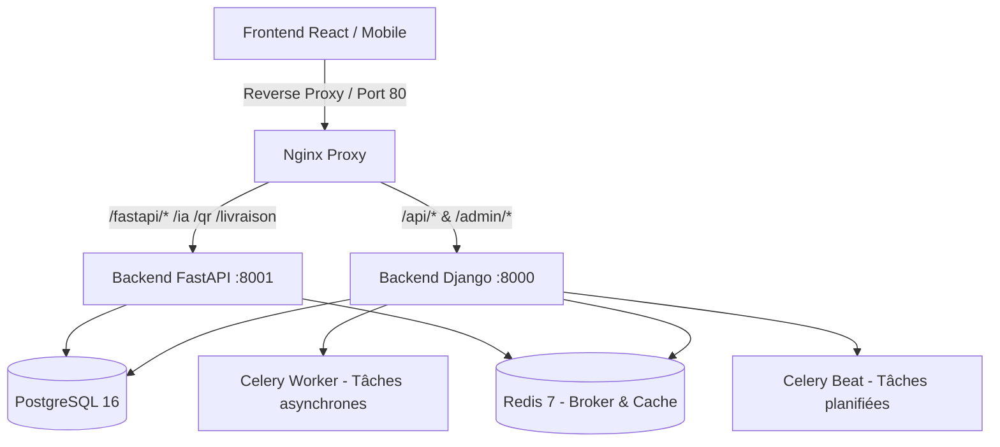
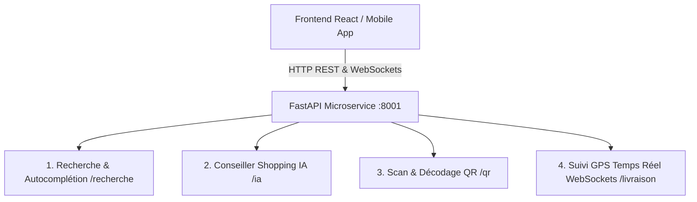

# 📊 Rapport d'Analyse Technique du Backend ANITCHE

> **Projet** : Plateforme E-Commerce ANITCHE  
> **Date d'analyse** : Août 2026  
> **Branche analysée** : `backend-django` (commit `e3f400f`)  
> **Architecture** : Hybride Django 6.0 REST Framework (Core transactionnel & métier) + FastAPI (Services rapides, temps réel & IA) + PostgreSQL 16 + Redis 7 + Celery (Worker & Beat) + Nginx

---

## 1. Vue d'Ensemble de l'Architecture

Le backend du projet **ANITCHE** repose sur une architecture moderne, conteneurisée et hautement modulaire :



1. **`backend-django`** : Cœur relationnel et transactionnel de la marketplace. Assure l'authentification (JWT SimpleJWT, Google OAuth), le contrôle d'accès strict par rôle, la gestion des boutiques, le catalogue et stocks, les paniers, la création et le fractionnement multi-vendeurs des commandes, la gestion des livraisons avec audit et le support client.
2. **`backend-fastapi`** : Microservice asynchrone pour la haute performance et les interactions spécialisées (conseiller IA, moteur de recherche vectorielle/sémantique, scan de passeports QR, télémétrie de suivi temps réel).
3. **`infra`** : Environnement complet conteneurisé Docker Compose orchestrant Django, FastAPI, PostgreSQL 16, Redis 7, Celery Worker, Celery Beat et le frontend React/Vite.

---

## 2. État d'Avancement des Modules Django (`apps/`)

Le backend Django est articulé en **12 applications modulaires** situées dans `backend-django/apps/`.

| Module (`app`) | Statut | Description & Fonctionnalités Clés |
| :--- | :---: | :--- |
| **`utilisateurs`** | ✅ **Terminé** | Modèle `Utilisateur` personnalisé, 7 rôles, flux KYC complet, système OTP sécurisé (haché), JWT SimpleJWT, réinitialisation de mot de passe, authentification Google OAuth2 (`ConnexionGoogleView`), tâches Celery d'envoi d'emails et nettoyage des OTP. |
| **`vendeurs`** | ✅ **Terminé** | Modèle `Boutique`, validation administrative KYC, modèle proxy `DemandeVendeur`, services transactionnels stricts, permissions par rôle, 11 endpoints d'API. |
| **`catalogue`** | ✅ **Terminé** | Catégories arborescentes (`parent`/`sous_categories`), `Produit`, `ImageProduit` (gestion de photo principale), `VarianteProduit` (prix effectif, SKU automatique, poids), `Stock` avec décrémentation atomique `F()` anti-concurrence, endpoints publics et espace vendeur. |
| **`panier`** | ✅ **Terminé** | Gestion unifiée (`Panier`, `PanierItem`) pour visiteurs anonymes (session) et utilisateurs connectés, synchronisation dynamique avec les variantes et stocks du catalogue, calcul en temps réel des totaux. |
| **`commandes`** | ✅ **Terminé** | Tunnel d'achat transactionnel (`ValiderPanierView`), fractionnement multi-boutiques automatique via `GroupeCommande` et `Commande`, verrouillage pessimiste `select_for_update` sur les stocks, décrémentation atomique, vidage sécurisé du panier, historique des commandes et articles. |
| **`livraison`** | ✅ **Terminé** | Liaison OneToOne `Commande` / `Livraison`, gestion du cycle de vie des colis (en attente, expédiée, en cours, livrée, échouée), traçabilité complète via `LivraisonHistorique` (Qui / Quoi / Pourquoi), signal Django `livraison_status_change`, filtrage des vues par rôle (client, livreur assigné, admin). |
| **`support`** | ✅ **Terminé** | Système de tickets (`SupportTicket`) avec liaisons optionnelles `Boutique`, `Commande` et `Produit`, messages chronologiques (`TicketMessage`), pièces jointes (`TicketAttachment`), notes internes staff, visibilité granulaire par rôle. |
| **`paiements`** | ✅ **Terminé** | Gestion complète des transactions (`Paiement`), moyens de paiement locaux (Wave, Orange Money, MTN, Moov, Carte bancaire, Espèce/COD), webhooks idempotents (`JournalWebhook`), validation automatique des commandes et création des fiches `Livraison` via signaux Django. |
| **`notifications`** | ✅ **Terminé** | Modèle `Notification` (In-App, Email, SMS, Push), gestion des `PreferenceNotification`, écouteurs de signaux automatiques pour paiements validés (client/vendeurs) et changements de statuts de livraison, endpoints de lecture et compteur. |
| **`retours`** | ✅ **Terminé** | Gestion complète des retours (`DemandeRetour`, `RetourItem`, `PhotoRetour`), workflow d'approbation boutique/staff, réintégration automatique des stocks (`stock.incrementer`) lors de la réception et notifications. |
| **`fidelite`** | ✅ **Terminé** | Programme de fidélité (`CompteFidelite`, `TransactionFidelite`, `CouponReduction`), crédit automatique de points sur paiement validé (1 pt / 1000 FCFA), conversion de points en bons de réduction et vérification panier. |
| **`passeport_qr`**| ✅ **Terminé** | Traçabilité et authenticité des produits (`PasseportProduit`, `HistoriqueScanPasseport`), génération de QR codes uniques, URL de vérification publique et télémétrie des scans consommateurs. |

---

## 3. Analyse Détaillée des Modules Implémentés

### 🔐 1. Module `utilisateurs`

* **Fichiers principaux** :
  - [`models.py`](file:///c:/Users/Jordan/Documents/Anitche/backend-django/apps/utilisateurs/models.py) :
    - `Role` : `client`, `vendeur`, `livreur`, `moderateur`, `support`, `admin`, `super_admin`.
    - `StatutKYC` : `non_soumis`, `en_attente`, `valide`, `refuse`.
    - `Utilisateur` : Authentification basée sur `email`, flags `email_verifie` / `telephone_verifie`, support du champ `google_id`.
    - `DocumentKYC` : Stockage des pièces d'identité, selfies, documents d'entreprise et RIB / Mobile Money.
    - `CodeOTP` : Codes sécurisés à 6 chiffres (durée de validité configurable, 5 tentatives max), hachés en base (`make_password`) pour prévenir toute compromission.
  - [`views.py`](file:///c:/Users/Jordan/Documents/Anitche/backend-django/apps/utilisateurs/views.py) :
    - Inscription, vérification OTP, connexion standard avec throttling `ScopedRateThrottle`.
    - `ConnexionGoogleView` : Validation du jeton OAuth2 Google (`google-auth`), création ou rattachement automatique de compte avec émission de tokens JWT.
  - [`tasks.py`](file:///c:/Users/Jordan/Documents/Anitche/backend-django/apps/utilisateurs/tasks.py) :
    - `nettoyer_otp_expires` : Tâche planifiée Celery Beat pour purger les OTP obsolètes (> 24h).
    - `envoyer_code_otp_email` : Envoi asynchrone des codes de vérification par email sans bloquer le thread HTTP.
  - [`urls.py`](file:///c:/Users/Jordan/Documents/Anitche/backend-django/apps/utilisateurs/urls.py) :
    - `POST /api/utilisateurs/inscription/`
    - `POST /api/utilisateurs/connexion/` & `/connexion/rafraichir/`
    - `POST /api/utilisateurs/connexion-google/`
    - `GET/PUT/PATCH /api/utilisateurs/profil/`
    - `POST /api/utilisateurs/changement-contact/`
    - `POST /api/utilisateurs/verification-otp/`
    - `POST /api/utilisateurs/demande-vendeur/` & `/upload-kyc/`
    - `POST /api/utilisateurs/mot-de-passe-oublie/` & `/mot-de-passe-oublie/confirmer/`
  - [`tests.py`](file:///c:/Users/Jordan/Documents/Anitche/backend-django/apps/utilisateurs/tests.py) : Tests exhaustifs de validation KYC, OTP, JWT et récupération de compte.

---

### 🏪 2. Module `vendeurs`

* **Fichiers principaux** :
  - [`models.py`](file:///c:/Users/Jordan/Documents/Anitche/backend-django/apps/vendeurs/models.py) :
    - `Boutique` : OneToOne avec `Utilisateur`, génération automatique de slugs uniques, photos (logo, bannière), propriété calculée `est_publiable` (dépend de `statut_kyc = valide` et `est_active = True`).
    - `DemandeVendeur` : Modèle proxy filtré sur `statut_kyc = en_attente` pour les vues d'administration.
  - [`services.py`](file:///c:/Users/Jordan/Documents/Anitche/backend-django/apps/vendeurs/services.py) :
    - `valider_demande_vendeur()` : Transaction atomique passant `statut_kyc = valide` et `role = vendeur`.
    - `refuser_demande_vendeur()` : Transaction atomique passant `statut_kyc = refuse` avec traçage du motif.
  - [`permissions.py`](file:///c:/Users/Jordan/Documents/Anitche/backend-django/apps/vendeurs/permissions.py) : `EstVendeurValide`, `EstAdministrateur`, `EstProprietaireDeLaBoutique`.
  - [`urls.py`](file:///c:/Users/Jordan/Documents/Anitche/backend-django/apps/vendeurs/urls.py) :
    - Public : `GET /api/vendeurs/boutiques/`, `GET /api/vendeurs/boutiques/<slug>/`
    - Espace Vendeur : `GET/PUT/PATCH /api/vendeurs/ma-boutique/`
    - Administration : `GET /api/vendeurs/administration/demandes/`, `POST .../<id>/valider/`, `POST .../<id>/refuser/`, `GET/PUT /api/vendeurs/administration/boutiques/`
  - [`tests.py`](file:///c:/Users/Jordan/Documents/Anitche/backend-django/apps/vendeurs/tests.py) : Suites complètes validant l'étanchéité des rôles et l'accès aux boutiques.

---

### 📦 3. Module `catalogue`

* **Fichiers principaux** :
  - [`models.py`](file:///c:/Users/Jordan/Documents/Anitche/backend-django/apps/catalogue/models.py) :
    - `Categorie` : Arborescence parent/enfant (`related_name='sous_categories'`), auto-slug unique, gestion de l'ordre d'affichage, protection contre l'auto-parentalité récursive.
    - `Produit` : Rattaché à `Boutique` et `Categorie`, slug unique auto-généré avec suffixe aléatoire, propriété `est_achetable` s'appuyant sur la règle métier centrale de `Boutique.est_publiable`.
    - `ImageProduit` : Galerie photos avec bascule automatique de l'image principale (décochage des autres images à l'enregistrement).
    - `VarianteProduit` : SKU unique auto-généré, nom de déclinaison, prix standard, `prix_promo`, poids unitaire `poids_kg` (pour devis de livraison), propriété `prix_effectif`.
    - `Stock` : Relation OneToOne avec `VarianteProduit`. Méthode critique `decrementer()` implémentant un `UPDATE` SQL conditionnel atomique avec `F('quantite_disponible') - quantite` et contrôle de seuil d'alerte, garantissant l'intégrité face aux requêtes concurrentes.
  - [`views.py`](file:///c:/Users/Jordan/Documents/Anitche/backend-django/apps/catalogue/views.py) & [`permissions.py`](file:///c:/Users/Jordan/Documents/Anitche/backend-django/apps/catalogue/permissions.py) :
    - Vues publiques en lecture seule (filtrage strict sur `Produit.publies()`).
    - Vues vendeur protégées par `EstVendeurValide` et `EstProprietaireDuProduit` (isolation totale des boutiques).
  - [`urls.py`](file:///c:/Users/Jordan/Documents/Anitche/backend-django/apps/catalogue/urls.py) :
    - Public : `GET /api/catalogue/categories/`, `GET .../categories/<slug>/`, `GET /api/catalogue/produits/`, `GET .../produits/<slug>/`
    - Vendeur : `GET/POST /api/catalogue/vendeur/produits/`, `GET/PUT/PATCH/DELETE .../produits/<pk>/`, `GET/POST .../produits/<pk>/variantes/`, `GET/PUT/PATCH/DELETE .../variantes/<pk>/`, `PATCH .../variantes/<pk>/stock/`, `GET/POST .../produits/<pk>/images/`, `DELETE .../images/<pk>/`
  - [`tests.py`](file:///c:/Users/Jordan/Documents/Anitche/backend-django/apps/catalogue/tests.py) : Tests complets couvrant l'arborescence des catégories, l'isolation des vendeurs, la publication conditionnelle et la concurrence de stock.

---

### 🛒 4. Module `panier`

* **Fichiers principaux** :
  - [`models.py`](file:///c:/Users/Jordan/Documents/Anitche/backend-django/apps/panier/models.py) :
    - `Panier` : Clé primaire UUID, champ `utilisateur` (si connecté) OU `session_key` (si visiteur anonyme). Propriétés calculées `total` et `nombre_articles`.
    - `PanierItem` : Liaison directe avec `catalogue.VarianteProduit`, quantité, propriétés `prix_unitaire` et `sous_total` basées sur `variante.prix_effectif`.
  - [`views.py`](file:///c:/Users/Jordan/Documents/Anitche/backend-django/apps/panier/views.py) :
    - `get_or_create_panier(request)` : Identification transparente de la session ou de l'utilisateur connecté.
    - `PanierItemListCreateView` : Contrôle de disponibilité du stock en amont avant ajout ou incrémentation d'un article.
    - `PanierItemDetailView` : Mise à jour de quantité ou retrait d'articles avec validation de stock.
  - [`urls.py`](file:///c:/Users/Jordan/Documents/Anitche/backend-django/apps/panier/urls.py) :
    - `GET /api/panier/panier/` : Consultation globale du panier et de ses totaux.
    - `GET/POST /api/panier/panier/items/` : Consultation des lignes et ajout d'une variante.
    - `GET/PUT/PATCH/DELETE /api/panier/panier/items/<uuid:pk>/` : Modification ou suppression d'une ligne d'article.
  - [`tests.py`](file:///c:/Users/Jordan/Documents/Anitche/backend-django/apps/panier/tests.py) : Validation des scénarios anonymes et authentifiés.

---

### 💳 5. Module `commandes`

* **Fichiers principaux** :
  - [`models.py`](file:///c:/Users/Jordan/Documents/Anitche/backend-django/apps/commandes/models.py) :
    - `Commande` : UUID, numéro lisible (`CMD-2026-XXXXXXXX`), statut (`creee`, `confirmee`, `preparation`, `expediee`, `livree`, `annulee`), rattachée à un `client`, une `Boutique` et un `GroupeCommande`.
    - `GroupeCommande` : Regroupe les commandes issues d'un même panier multi-boutiques passé lors d'un même checkout.
    - `CommandeItem` : Ligne de commande enregistrant la variante, le nom du produit figé à l'achat, le prix unitaire et la quantité.
  - [`views.py`](file:///c:/Users/Jordan/Documents/Anitche/backend-django/apps/commandes/views.py) :
    - `ValiderPanierView` : Endpoint central de checkout exécuté dans une transaction SQL atomique (`transaction.atomic()`) :
      1. Regroupement automatique des articles du panier par boutique.
      2. Pose d'un verrou pessimiste (`select_for_update()`) sur l'ensemble des lignes `Stock` concernées.
      3. Contrôle strict de disponibilité pour chaque article.
      4. Création du `GroupeCommande`, création d'une `Commande` par boutique avec ses `CommandeItem`.
      5. Décrémentation atomique des stocks.
      6. Vidage complet du panier.
    - `GroupeCommandeListView`, `CommandeListView`, `CommandeDetailView`, `CommandeItemListView` : Consultation de l'historique d'achat sécurisé par client.
  - [`urls.py`](file:///c:/Users/Jordan/Documents/Anitche/backend-django/apps/commandes/urls.py) :
    - `POST /api/commandes/valider-panier/`
    - `GET /api/commandes/groupes/`
    - `GET /api/commandes/`
    - `GET /api/commandes/<uuid:pk>/`
    - `GET /api/commandes/<uuid:commande_id>/items/`
  - [`tests.py`](file:///c:/Users/Jordan/Documents/Anitche/backend-django/apps/commandes/tests.py) : 177 lignes de tests couvrant le fractionnement multi-vendeurs, le calcul des montants, les verrous de stock et les rollbacks en cas d'erreur.

---

### 🚚 6. Module `livraison`

* **Fichiers principaux** :
  - [`models.py`](file:///c:/Users/Jordan/Documents/Anitche/backend-django/apps/livraison/models.py) :
    - `Livraison` : Relation `OneToOne` avec `commandes.Commande`, livreur assigné (`Utilisateur` avec rôle livreur), statut (`en_attente`, `expediee`, `en_cours`, `livree`, `echouee`), adresse de livraison, dates d'expédition et de livraison effectives.
    - `LivraisonHistorique` : Audit trail enregistrant chaque transition de statut (`ancien_status` → `nouveau_status`), l'auteur de l'action (`effectue_par`), un commentaire explicatif et l'horodatage précis.
    - Méthode `changer_status()` : Met à jour les statuts et dates clés, crée l'entrée d'historique et émet le signal Django.
  - [`signals.py`](file:///c:/Users/Jordan/Documents/Anitche/backend-django/apps/livraison/signals.py) : Signal custom `livraison_status_change` pour découpler les futures notifications SMS/Push client.
  - [`views.py`](file:///c:/Users/Jordan/Documents/Anitche/backend-django/apps/livraison/views.py) :
    - `LivraisonListView` : Filtrage dynamique par rôle (le client ne voit que ses commandes, le livreur ne voit que ses courses assignées, l'administrateur a une vue globale).
    - `LivraisonChangerStatusView` : Modification du statut réservée au livreur assigné ou au staff d'administration.
    - `LivraisonHistoriqueListView` : Consultation de la chronologie des étapes de livraison.
  - [`urls.py`](file:///c:/Users/Jordan/Documents/Anitche/backend-django/apps/livraison/urls.py) :
    - `GET /api/livraison/`
    - `GET /api/livraison/<uuid:pk>/`
    - `PATCH /api/livraison/<uuid:pk>/statut/`
    - `GET /api/livraison/<uuid:livraison_id>/historique/`
  - [`tests.py`](file:///c:/Users/Jordan/Documents/Anitche/backend-django/apps/livraison/tests.py) : 200 lignes de tests validant les permissions par rôle, le passage des statuts et l'enregistrement de l'historique d'audit.

---

### 🎫 7. Module `support`

* **Fichiers principaux** :
  - [`models.py`](file:///c:/Users/Jordan/Documents/Anitche/backend-django/apps/support/models.py) :
    - `SupportTicket` : UUID, numéro lisible (`TCK-2026-XXXXXXXX`), catégorie (livraison, paiement, produit, litige vendeur, compte, autre), statut (`open`, `in_progress`, `waiting_customer`, `resolved`, `closed`), priorité, liaisons optionnelles `vendor` (`Boutique`), `order` (`Commande`) et `product` (`Produit`).
    - `TicketMessage` : Auteur, rôle figé (`author_role`), note interne réservée au staff (`is_internal_note`), horodatage de lecture (`read_at`).
    - `TicketAttachment` : Fichiers stockés par date (`/attachments/%Y/%m/`), taille, type.
  - [`views.py`](file:///c:/Users/Jordan/Documents/Anitche/backend-django/apps/support/views.py) :
    - Règle de visibilité centralisée `get_visible_tickets(user)` par rôle.
    - Protection contre la suppression physique non-staff.
    - Transition de statut : un client peut uniquement fermer son propre ticket (`CLOSED`), le staff peut effectuer toute transition.
  - [`urls.py`](file:///c:/Users/Jordan/Documents/Anitche/backend-django/apps/support/urls.py) :
    - `/api/support/tickets/` (CRUD & filtrage)
    - `/api/support/tickets/<pk>/status/`
    - `/api/support/tickets/<ticket_id>/messages/`
    - `/api/support/messages/<message_id>/attachments/`
  - [`tests.py`](file:///c:/Users/Jordan/Documents/Anitche/backend-django/apps/support/tests.py) : Tests exhaustifs de création, filtrage, messages, permissions et pièces jointes.

---

### 💳 8. Module `paiements`

* **Fichiers principaux** :
  - [`models.py`](file:///c:/Users/Jordan/Documents/Anitche/backend-django/apps/paiements/models.py) :
    - `Paiement` : Clé primaire UUID, référence lisible (`PAY-2026-XXXXXXXX`), montant, devise (`XOF`), méthodes supportées (`wave`, `orange_money`, `mtn_money`, `moov_money`, `carte_bancaire`, `espece_livraison`), statuts (`en_attente`, `valide`, `echoue`, `annule`, `rembourse`), transaction externe, adresse de livraison et métadonnées JSON.
    - `JournalWebhook` : Journalisation d'audit et vérification d'idempotence des callbacks asynchrones des passerelles (`unique_together` sur `fournisseur` + `evenement_id`).
  - [`signals.py`](file:///c:/Users/Jordan/Documents/Anitche/backend-django/apps/paiements/signals.py) :
    - Signal `paiement_valide` : Déclenché lors de la validation atomique.
    - Met à jour le statut des commandes associées (`CONFIRMEE`) et génère automatiquement la fiche `Livraison` (`EN_ATTENTE`).
  - [`services.py`](file:///c:/Users/Jordan/Documents/Anitche/backend-django/apps/paiements/services.py) :
    - `initier_paiement` : Création de la session de paiement pour une commande individuelle ou un groupe de commandes multi-boutiques, avec traitement immédiat pour le Cash on Delivery.
    - `traiter_webhook` : Traitement sécurisé et idempotent des notifications de paiement.
  - [`views.py`](file:///c:/Users/Jordan/Documents/Anitche/backend-django/apps/paiements/views.py) :
    - `POST /api/paiements/initier/` : Initiation de transaction par le client.
    - `GET /api/paiements/` : Consultation des paiements (isolée par client, globale pour admin).
    - `GET /api/paiements/<uuid:pk>/` : Détail d'une transaction.
    - `POST /api/paiements/webhook/<str:fournisseur>/` : Endpoint public de webhook avec vérification et traçabilité.
  - [`tests.py`](file:///c:/Users/Jordan/Documents/Anitche/backend-django/apps/paiements/tests.py) : Tests complets validant l'initiation (Wave, OM, COD, groupes multi-vendeurs), les rejets sur commandes déjà réglées, l'isolation client, l'idempotence des webhooks et la génération automatique des livraisons.

---

### 🔔 9. Module `notifications`

* **Fichiers principaux** :
  - [`models.py`](file:///c:/Users/Jordan/Documents/Anitche/backend-django/apps/notifications/models.py) :
    - `Notification` : UUID, destinataire (`Utilisateur`), titre, message, type (`commande`, `paiement`, `livraison`, `kyc`, `stock`, `support`, `systeme`), canal (`in_app`, `email`, `sms`, `push`), état de lecture `est_lu`, date de lecture, lien de redirection et métadonnées JSON.
    - `PreferenceNotification` : Configuration par utilisateur des canaux actifs (`email_actif`, `sms_actif`, `in_app_actif`).
  - [`signals.py`](file:///c:/Users/Jordan/Documents/Anitche/backend-django/apps/notifications/signals.py) :
    - Écouteur `paiement_valide` : Notifie automatiquement le client de la confirmation de son règlement et notifie chaque boutique concernée qu'une commande est prête à être préparée.
    - Écouteur `livraison_status_change` : Notifie le client en temps réel lors du départ, de la prise en charge par le livreur et de la remise du colis.
  - [`services.py`](file:///c:/Users/Jordan/Documents/Anitche/backend-django/apps/notifications/services.py) :
    - `ServiceNotification.notifier_utilisateur` : Envoi multicanal respectant les préférences actives de l'utilisateur.
    - `ServiceNotification.marquer_toutes_lues` : Mise à jour en masse des notifications non lues.
  - [`views.py`](file:///c:/Users/Jordan/Documents/Anitche/backend-django/apps/notifications/views.py) :
    - `GET /api/notifications/` : Liste paginée des alertes de l'utilisateur (avec filtres `?non_lues=true` et `?type=...`).
    - `GET /api/notifications/compteur/` : Compteur temps réel des notifications non lues.
    - `PATCH /api/notifications/<uuid:pk>/lire/` : Marquage d'une notification comme lue.
    - `POST /api/notifications/toutes-lues/` : Marquage global.
    - `GET/PUT/PATCH /api/notifications/preferences/` : Gestion des préférences de canaux.
  - [`tests.py`](file:///c:/Users/Jordan/Documents/Anitche/backend-django/apps/notifications/tests.py) : Tests validant l'isolation entre utilisateurs, le filtrage des non-lues, le marquage individuel/global, la modification des préférences et les déclenchements automatiques sur signaux de paiement et livraison.

---

### 🔄 10. Module `retours`

* **Fichiers principaux** :
  - [`models.py`](file:///c:/Users/Jordan/Documents/Anitche/backend-django/apps/retours/models.py) :
    - `DemandeRetour` : Numérotation `RET-2026-XXXXXXXX`, rattachée à la `Commande`, au `Client` et à la `Boutique`, motifs (`produit_defectueux`, `non_conforme`, `mauvaise_taille`, `article_manquant`, `changement_avis`, `autre`), résolution (`remboursement`, `echange`, `avoir`), statuts (`demande`, `approuve`, `rejete`, `en_transit`, `receptionne`, `rembourse`, `cloture`), calcul automatique du `montant_remboursement`.
    - `RetourItem` : Lignes d'articles rattachées à `CommandeItem` avec contrôle des quantités.
    - `PhotoRetour` : Galerie de preuves justificatives photographiques.
  - [`signals.py`](file:///c:/Users/Jordan/Documents/Anitche/backend-django/apps/retours/signals.py) :
    - Signal `retour_status_change` : Notifie automatiquement le client et la boutique lors des étapes du retour.
  - [`views.py`](file:///c:/Users/Jordan/Documents/Anitche/backend-django/apps/retours/views.py) :
    - `GET/POST /api/retours/` : Liste et création d'une demande de retour client avec contrôle d'éligibilité.
    - `GET /api/retours/<uuid:pk>/` : Consultation détaillée d'un retour.
    - `POST /api/retours/<uuid:pk>/photos/` : Upload de photos justificatives.
    - `GET /api/retours/vendeur/liste/` : Espace vendeur pour superviser les retours liés à sa boutique.
    - `PATCH /api/retours/<uuid:pk>/traiter/` : Approbation/rejet par le vendeur ou le staff, et ré-incrémentation automatique des stocks lors de la réception du colis.
  - [`urls.py`](file:///c:/Users/Jordan/Documents/Anitche/backend-django/apps/retours/urls.py) : Routes d'API intégrées au projet.
  - [`tests.py`](file:///c:/Users/Jordan/Documents/Anitche/backend-django/apps/retours/tests.py) : Tests complets validant la création de retours, le rejet sur quantités excessives, le filtrage par boutique, le workflow de validation vendeur et la réintégration automatique du stock en base.

---

### 🎁 11. Module `fidelite`

* **Fichiers principaux** :
  - [`models.py`](file:///c:/Users/Jordan/Documents/Anitche/backend-django/apps/fidelite/models.py) :
    - `CompteFidelite` : Solde de points, points cumulés à vie, calcul dynamique du palier (`Bronze`, `Argent`, `Or`, `Platine`), méthodes `crediter_points()` et `debiter_points()`.
    - `TransactionFidelite` : Audit complet des mouvements de points (`GAIN`, `DEPENSE`, `EXPIRATION`, `BONUS_PARRAINAGE`, `AJUSTEMENT_ADMIN`).
    - `CouponReduction` : Bons de réduction nominatifs ou publics, type (`pourcentage`, `montant_fixe`), montant minimum d'achat, date d'expiration, méthode de calcul de remise `calculer_remise()`.
  - [`signals.py`](file:///c:/Users/Jordan/Documents/Anitche/backend-django/apps/fidelite/signals.py) :
    - Écouteur `paiement_valide` : Crédite automatiquement 1 point par tranche de 1000 FCFA dépensée et envoie une notification de gain au client.
  - [`views.py`](file:///c:/Users/Jordan/Documents/Anitche/backend-django/apps/fidelite/views.py) :
    - `GET /api/fidelite/mon-compte/` : Consultation du solde et palier de fidélité.
    - `GET /api/fidelite/transactions/` : Historique des points.
    - `GET /api/fidelite/mes-coupons/` : Liste des bons de réduction.
    - `POST /api/fidelite/convertir-points/` : Échange de points contre un bon de réduction personnalisé.
    - `POST /api/fidelite/verifier-coupon/` : Vérification et simulation du montant remisé sur le panier.
  - [`urls.py`](file:///c:/Users/Jordan/Documents/Anitche/backend-django/apps/fidelite/urls.py) : Routes intégrées à l'API.
  - [`tests.py`](file:///c:/Users/Jordan/Documents/Anitche/backend-django/apps/fidelite/tests.py) : Tests du crédit automatique, de l'évolution des paliers, de la conversion de points et de l'application sécurisée des coupons.

---

### 🛡️ 12. Module `passeport_qr`

* **Fichiers principaux** :
  - [`models.py`](file:///c:/Users/Jordan/Documents/Anitche/backend-django/apps/passeport_qr/models.py) :
    - `PasseportProduit` : Identifiant unique `PAS-2026-XXXXXXXX`, rattaché au `Produit`, à la `Variante` et à la `Boutique`, traçabilité des matériaux, région d'origine, artisan créateur, date de fabrication, statut de certification (`certifie_authentique`, `label_local`, `standard`), compteur `nb_scans` et horodatage du dernier scan.
    - `HistoriqueScanPasseport` : Enregistrement de télémétrie des scans (adresse IP, User-Agent, horodatage).
  - [`views.py`](file:///c:/Users/Jordan/Documents/Anitche/backend-django/apps/passeport_qr/views.py) :
    - `GET /api/passeports/verifier/<str:code_passeport>/` : Consultation publique sans authentification du passeport numérique et enregistrement automatique du scan.
    - `GET/POST /api/passeports/vendeur/` : Espace vendeur pour lister et créer les passeports de ses produits.
    - `GET/PUT/PATCH/DELETE /api/passeports/vendeur/<uuid:pk>/` : Gestion du passeport par le vendeur propriétaire.
  - [`urls.py`](file:///c:/Users/Jordan/Documents/Anitche/backend-django/apps/passeport_qr/urls.py) : Routes d'API intégrées.
  - [`tests.py`](file:///c:/Users/Jordan/Documents/Anitche/backend-django/apps/passeport_qr/tests.py) : Tests de création par le vendeur, rejet sur produit tiers, consultation publique et incrémentation de scans.

---

## 4. Microservice `backend-fastapi` (Services Rapides & Temps Réel)

Le microservice FastAPI fournit des endpoints asynchrones haute performance pour les fonctionnalités interactives du frontend et des applications mobiles :



* **1. Recherche Rapide & Suggestions ([`routeurs/recherche.py`](file:///c:/Users/Jordan/Documents/Anitche/backend-fastapi/app/routeurs/recherche.py))** :
  - `GET /recherche/produits` : Recherche textuelle multicritères avec facettes (catégories, fourchettes de prix, boutiques) et tri intelligent.
  - `GET /recherche/suggestions` : Suggestions instantanées d'autocomplétion pendant la frappe utilisateur.
* **2. Conseiller Shopping IA ([`routeurs/conseiller_ia.py`](file:///c:/Users/Jordan/Documents/Anitche/backend-fastapi/app/routeurs/conseiller_ia.py))** :
  - `POST /ia/conseil` : Analyse contextuelle (cérémonie, mariage, style, budget) et recommandations argumentées de pièces artisanales et de mode ivoirienne.
  - `POST /ia/recommandations` : Suggestions personnalisées par catégories favorites et budget.
* **3. Scan & Validation QR ([`routeurs/scan_qr.py`](file:///c:/Users/Jordan/Documents/Anitche/backend-fastapi/app/routeurs/scan_qr.py))** :
  - `POST /qr/scan` & `GET /qr/passeport/{code}` : Décodage instantané de codes ou URLs QR de passeports et certification d'authenticité.
* **4. Suivi GPS & Télémétrie en Direct ([`routeurs/suivi_temps_reel.py`](file:///c:/Users/Jordan/Documents/Anitche/backend-fastapi/app/routeurs/suivi_temps_reel.py))** :
  - `POST /livraison/position` : Réception des coordonnées du livreur (latitude, longitude, vitesse, cap).
  - `GET /livraison/position/{id}` : Consultation de la dernière position et calcul de la distance restante / ETA.
  - `WebSocket /livraison/ws/{id}` : Streaming continu des positions en temps réel vers le client.
* **Validation & Tests ([`tests/test_api.py`](file:///c:/Users/Jordan/Documents/Anitche/backend-fastapi/tests/test_api.py))** : **13 tests automatisés pytest réussis à 100%**.

---

## 5. Synthèse Globale et État du Projet

```
+---------------------------------------------------------------------------------+
|                            ÉTAT DU BACKEND ANITCHE                              |
+---------------------------------------------------------------------------------+
|  [x] Infrastructure Docker & Orchestration (Django, FastAPI, Redis, Postgres)   |
|  [x] Module Utilisateurs (Auth JWT, Google OAuth2, KYC, OTP sécurisé, Celery)   |
|  [x] Module Vendeurs (Boutiques, Cycle de validation KYC, Modération)           |
|  [x] Module Catalogue (Catégories arborescentes, Produits, Variantes, Stocks)   |
|  [x] Module Panier (Visiteurs anonymes + Utilisateurs connectés, Sync Stock)    |
|  [x] Module Commandes (Checkout atomique, Split multi-vendeurs, Verrou SQL)     |
|  [x] Module Paiements (Wave, OM, MTN, Moov, Carte, COD, Webhooks, Signaux)      |
|  [x] Module Livraison (Affectation livreurs, Traçabilité d'audit, Signaux)      |
|  [x] Module Support (Tickets liés Boutique/Commande/Produit, Messages, Notes)   |
|  [x] Module Notifications (In-App, Email, SMS, Écouteurs signaux, Préférences)  |
|  [x] Module Retours (Demandes, Preuves photo, Workflow Vendeur, Restock auto)   |
|  [x] Module Fidélité (Points automatiques, Paliers, Conversion bons d'achat)    |
|  [x] Module Passeport QR (Authentification, Traçabilité, Télémétrie scans)      |
|  [x] Backend FastAPI (Recherche & Facettes, Conseiller IA, Scan QR, WebSockets) |
+---------------------------------------------------------------------------------+
|  TOTAL : 186 TESTS AUTOMATISÉS RÉUSSIS (173 Django + 13 FastAPI, 0 Erreur)      |
+---------------------------------------------------------------------------------+
|  [ ] Frontend React / Vite (Pages interactives et branchement aux APIs)         |
+---------------------------------------------------------------------------------+
```

---

## 6. Prochaines Étapes Prioritaires

1. **Frontend React / Vite (`frontend/`)** :
   - Développer les vues et composants connectés aux APIs : Authentification, Catalogue & Recherche rapide, Panier & Checkout multi-boutiques, Conseiller IA interactif, Dashboard Vendeur, Espace Client & Suivi Livraison avec carte en direct.


