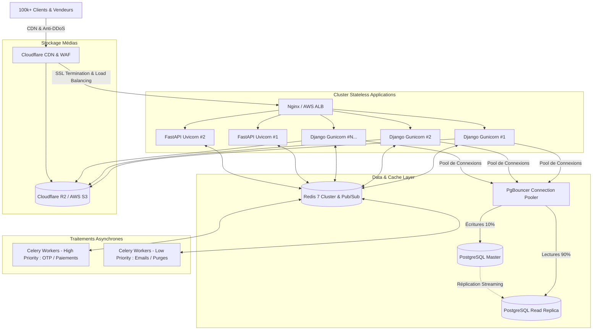

# 🚀 Architecture & Stratégie de Montée en Charge (100 000+ Utilisateurs) — ANITCHE

Ce document détaille l'architecture cible, les mécanismes de dimensionnement horizontal, les optimisations de base de données et les stratégies de mise en cache pour absorber **plus de 100 000 utilisateurs actifs** et des pics de trafic (fêtes, lancements de collections, soldes).

---

## 1. Vue d'Ensemble de l'Architecture Haute Disponibilité

---

## 2. Piliers Techniques pour Scaler à 100 000+ Utilisateurs

### ⚡ A. Base de Données PostgreSQL & PgBouncer
1. **Connection Pooling avec PgBouncer** :
   - *Problème* : PostgreSQL alloue ~5 à 10 Mo de RAM par connexion. 10 000 connexions directes satureraient le serveur (50-100 Go de RAM gaspillée).
   - *Solution* : `PgBouncer` en mode `transaction` maintient des milliers de connexions clientes légères tout en ne gardant que **50 à 100 connexions réelles persistantes** vers PostgreSQL.
2. **Séparation Lecture / Écriture (Read Replicas)** :
   - 90% du trafic sur un e-commerce est de la consultation (pages produits, catalogue, avis, recherche, profil).
   - Configuration d'un routeur de base de données Django (`PrimaryReplicaRouter`) pour diriger les `SELECT` vers les répliques en lecture et réserver le nœud maître aux `INSERT/UPDATE/DELETE` (checkout, paiement).
3. **Partitionnement des Tables Volumineuses** :
   - Tables comme `JournalWebhook`, `Notification`, `HistoriqueScanPasseport` et `TransactionFidelite` partitionnées mensuellement par date (`PARTITION BY RANGE (date_creation)`).

---

### 🌐 B. Scalabilité Horizontale des Serveurs (Stateless)
1. **Conteneurs Django & FastAPI Découplés** :
   - Ni Django ni FastAPI ne conservent d'état en mémoire locale (sessions dans Redis, tokens JWT signés sans session serveur).
   - Déploiement en **Auto-Scaling (HPA - Kubernetes ou Docker Swarm)** :
     - *Trafic normal* : 3 instances Django + 2 instances FastAPI.
     - *Pic de trafic (Promotion / Soirée)* : Montée automatique à 10-15+ instances en quelques secondes.

---

### 📦 C. Déport des Médias et Assets sur CDN & Object Storage (S3 / R2)
1. **Zéro charge statique sur les serveurs** :
   - Les photos de produits, documents KYC et logos boutiques sont stockés directement sur un Object Storage (AWS S3 ou Cloudflare R2).
   - Le CDN Cloudflare met en cache les images au plus près des utilisateurs en Afrique de l'Ouest (POP à Abidjan, Dakar, Accra) avec compression WebP automatique.
   - Temps de chargement des images réduit à **< 50 ms**.

---

### 🏎️ D. Caching Intelligent & Redis Cluster
1. **Cache des Données Fréquemment Consultées** :
   - Arborescence des catégories, produits vedettes, fiches boutiques en cache Redis (TTL 10 min).
   - Invalidation automatique par signaux Django (`post_save`, `post_delete`) lorsqu'un vendeur met à jour son produit.
2. **Redis Pub/Sub pour les WebSockets FastAPI** :
   - Permet à plusieurs instances de FastAPI de synchroniser les coordonnées GPS des livreurs en temps réel : un livreur émettant sur le nœud FastAPI A diffuse instantanément vers le client connecté sur le nœud FastAPI B.

---

### 📨 E. Files d'Attente Dédiées Celery (Workers Spécialisés)
1. **Isolation des files par criticité** :
   - **Queue `urgent`** : Génération des OTP SMS et validation des webhooks de paiement (latence garantie < 1s).
   - **Queue `notifications`** : Envoi des emails de confirmation et push notifications.
   - **Queue `background`** : Calculs de fidélité périodiques, nettoyage de sessions expirées, reporting financier.

---

## 3. Dimensionnement Recommandé pour 100k Utilisateurs Actifs

| Ressource | Configuration Minimale Conseillée | Rôle |
| :--- | :--- | :--- |
| **Load Balancer / CDN** | Cloudflare Pro + Nginx Reverse Proxy | Filtrage DDoS, SSL, CDN images & CSS |
| **App Servers Django** | 4 instances (4 vCPU, 8 Go RAM chacune) | Logique métier, ORM, API REST |
| **App Servers FastAPI** | 2 instances (2 vCPU, 4 Go RAM chacune) | Recherche rapide, IA, WebSockets |
| **Base PostgreSQL** | 1 Master + 1 Replica (8 vCPU, 32 Go RAM, NVMe) + PgBouncer | Données transactionnelles ACID |
| **Redis Cluster** | 3 nœuds (2 vCPU, 8 Go RAM) | Cache applicatif, Broker Celery, Pub/Sub |
| **Celery Workers** | 2 workers dédiés (4 vCPU, 8 Go RAM) | Exécution asynchrone des tâches |
| **Stockage Médias** | Cloudflare R2 / AWS S3 | Stockage illimité haute disponibilité |
