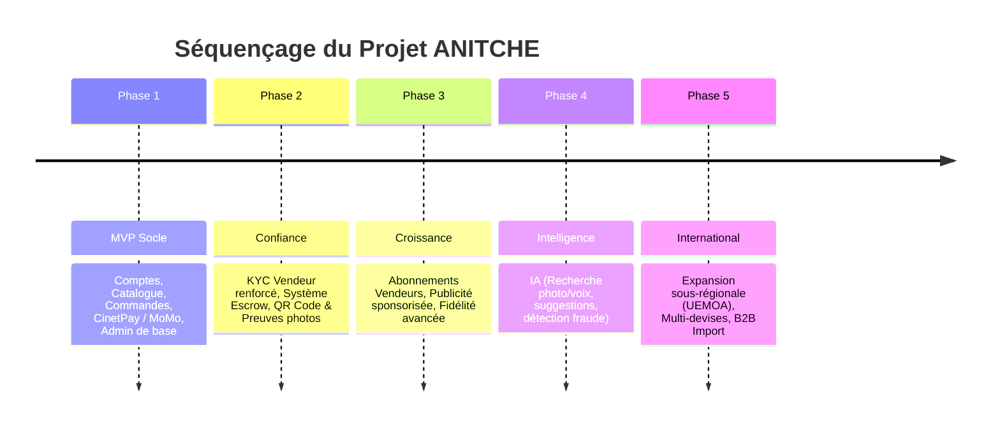

# CAHIER DES CHARGES PROJET ANITCHE (HEAVEN VERS)

> **Version :** 1.0  
> **Statut :** Document de Référence Projet  
> **Porteur de Projet :** Heaven & Son Équipe (`heavenvers@contact.ci`)  
> **Périmètre Cible :** Côte d'Ivoire & Afrique de l'Ouest  

---

## 1. PRÉSENTATION GÉNÉRALE DU PROJET

### 1.1 Contexte & Problématique
Le secteur du commerce de mode, des accessoires et des petits articles en Côte d'Ivoire et en Afrique de l'Ouest fait face à des défis majeurs :
- **Informel & Inaccessibilité :** Difficulté à trouver des articles spécifiques (vêtements, bijoux, perruques, accessoires) à proximité.
- **Tarifs Élévés :** Prix peu compétitifs dans les boutiques physiques traditionnelles.
- **Invisibilité des Commerces Locaux :** Manque de vitrine numérique pour les petits commerçants de qualité.
- **Faiblesses des Plateformes Actuelles (ex: Jumia) :** Délais de livraison longs, produits non conformes aux visuels, frais cachés, manque de confiance réciproque entre acheteurs et vendeurs.

### 1.2 Vision du Projet
**ANITCHE** (dérivé du concept initial HEAVEN VERS) est une marketplace e-commerce intelligente et multi-vendeurs visant à digitaliser l'ensemble de la chaîne d'achat : de la découverte du produit jusqu'à la livraison finale, avec paiement Mobile Money sécurisé et système d'Escrow (séquestre).

L'ambition est de devenir la **plateforme e-commerce N°1 en Côte d'Ivoire** puis une référence majeure en Afrique de l'Ouest.

### 1.3 Promesse & Valeurs
1. **Prix Justes :** Transparence totale sans frais cachés.
2. **Confiance & Anti-Contrefaçon :** Vendeurs vérifiés (KYC obligatoire) et produits avec passeport numérique/QR Code.
3. **Livraison Fiable & Suivie :** Suivi en temps réel des colis.
4. **Accessibilité & Simplicité :** Ergonomie mobile-first (pensée pour un usage à une main) compatible avec des connexions 2G/3G limitées.
5. **Innovation :** Recherche visuelle par photo, assistant IA, portefeuille intégré.

---

## 2. RÔLES ET PROFILS UTILISATEURS

La plateforme s'appuie sur **7 rôles d'utilisateurs distincts** pour garantir la sécurité et la gouvernance de l'écosystème :

| Rôle | Périmètre et Droits d'Accès |
|---|---|
| **Visiteur** | Navigation libre dans le catalogue, recherche et consultation des fiches produits sans création de compte. |
| **Client (Acheteur)** | Inscription (OTP), gestion du panier, passage de commande (< 3 étapes), paiement, suivi de livraison, avis et programme de fidélité. |
| **Vendeur / Boutique** | Gestion de boutique, publication de catalogue après validation KYC, suivi des ventes, commandes et tableau de bord. |
| **Livreur** | Interface dédiée avec liste des courses assignées par proximité, mise à jour des statuts en temps réel et preuve de livraison (photo). |
| **Modérateur** | Contrôle des produits signalés, gestion des avis et première ligne d'arbitrage avant escalade. |
| **Service Client** | Support utilisateur (tickets, WhatsApp), accompagnement des acheteurs et vendeurs, historique des échanges. |
| **Administrateur** | Supervision globale, validation des vendeurs/KYC, gestion des commissions, arbitrage des litiges et statistiques financières. |

---

## 3. MODÈLE COMMERCIAL (BUSINESS MODEL)

Le modèle économique d'ANITCHE repose sur une approche hybride à 3 niveaux :

```
┌────────────────────────────────────────────────────────┐
│                   Niveau 1 : Vente Directe             │
│   Sourcing direct (Chine/International) par ANITCHE    │
├────────────────────────────────────────────────────────┤
│             Niveau 2 : Boutiques Partenaires           │
│   Partenaires locaux sélectionnés avec % négocié       │
├────────────────────────────────────────────────────────┤
│             Niveau 3 : Marketplace & Commission        │
│   Vendeurs indépendants validés avec commission/vente  │
└────────────────────────────────────────────────────────┘
```

1. **Vente Directe (Sourcing Direct) :** Achat direct de vêtements, chaussures, bijoux et petits appareils pour garantir les marges et la disponibilité immédiate.
2. **Boutiques Partenaires Sélectionnées :** Accords contractuels avec des marques locales de confiance (% prélevé sur les ventes).
3. **Sous-Boutiques & Commission Marketplace :** Inscription en autonomie des commerçants indépendants après validation KYC, avec prélèvement d'une commission au succès et abonnements Vendeur (*Découverte, Business, Premium, Enterprise*).

---

## 4. ARCHITECTURE DES 18 EPICS DU BACKLOG

Le projet est structuré en **18 EPICs fonctionnels et techniques** :

### EPIC 1 — Découverte sans compte et authentification
- Consultation libre du catalogue sans blocage.
- Inscription et connexion par téléphone/email via OTP (SMS/Email).
- Option de connexion via Google et WhatsApp.
- Règle d'unicité des identifiants et suspension administrative des comptes frauduleux.

### EPIC 2 — Accueil et première impression
- Ergonomie sobre, fun et épurée adaptée au public ivoirien.
- Barre de recherche proéminente, accès direct aux catégories.
- Bannières promotionnelles non intrusives, produits à proximité (géolocalisation) et tendances du moment.

### EPIC 3 — Recherche intelligente
- Moteur de recherche multi-modal : texte, filtres avancés (prix, taille, couleur, ville, note).
- **Innovation :** Recherche par photo (analyse visuelle) et recherche vocale.
- Suggestions dynamiques et conseils budgétaires par IA.

### EPIC 4 — Catalogue et fiche produit
- Galerie d'images haute résolution et courtes vidéos démonstratives.
- Informations claires : prix, variantes (tailles/couleurs), état des stocks en temps réel, score de confiance du vendeur.
- Avis clients certifiés rattachés à des commandes effectives.

### EPIC 5 — Panier intelligent et commande
- Panier multi-vendeurs avec calcul dynamique des frais de port et réductions.
- Processus de commande fluide en **3 étapes maximum** :
  1. Récapitulatif du panier.
  2. Choix du mode de livraison.
  3. Paiement et confirmation.

### EPIC 6 — Paiement flexible et sécurisé
- **Moyens locaux :** Mobile Money (Wave, Orange Money, MTN MoMo, Moov Money).
- **Moyens internationaux :** Carte Visa/Mastercard, PayPal, CinetPay, Stripe.
- **Options d'achat :** Paiement à la livraison (cash/MoMo), paiement partiel (30/70 ou 50/50 pour articles éligibles).
- **Portefeuille ANITCHE :** Rechargement en ligne avec bonus incitatif (*ex: 10 000 FCFA rechargés = 500 FCFA offerts*).

### EPIC 7 — Livraison et suivi temps réel
- **Options de livraison :**
  - Express (même jour à Abidjan pour commandes avant heure limite).
  - Standard (J+1 à Abidjan et villes de l'intérieur).
  - Retrait en dépôt ANITCHE (gratuit).
  - Retrait direct en boutique partenaire.
- Suivi d'état étape par étape : *Reçue ➔ En préparation ➔ Prête / En cours ➔ Livrée / Récupérée*.

### EPIC 8 — Retours, réclamations et garantie ANITCHE
- Système protecteur avec contrôle visuel (photo/vidéo du produit avant expédition par l'équipe et photo à la livraison par le livreur).
- Délai de réclamation strict : **24h à 48h** après réception.
- Prise en charge des motifs légitimes : produit non conforme, endommagé ou mauvais article.
- Remboursement automatique sur le Portefeuille ANITCHE ou le moyen de paiement initial.

### EPIC 9 — Programme de fidélité
- Cumul automatique de points à chaque commande validée.
- Avantage franchi toutes les 10 transactions.
- **Niveaux de fidélité :**
  - *Bronze :* Client débutant, points de base.
  - *Argent (10 achats) :* 5% de réduction.
  - *Or (30 achats) :* 10% de réduction + cadeaux + livraison gratuite.
  - *Diamant VIP :* Avantages exclusifs + livraison express gratuite.

### EPIC 10 — Vendeurs, vérification (KYC) et abonnements
- Processus de vérification d'identité (KYC obligatoire : CNI/Passeport, selfie, justificatif Mobile Money/RIB).
- Signature des conditions vendeur.
- Formules d'abonnement vendeur et badge de confiance calculé selon la réactivité et la satisfaction client.

### EPIC 11 — Tableau de bord vendeur
- Espace de pilotage métier pour le commerçant : chiffre d'affaires, gestion des stocks, alerte de stock bas.
- Suivi des commandes en cours et statistiques des produits phares.
- Recommandations IA pour l'optimisation des prix et du stock.

### EPIC 12 — Back-office administrateur
- Console centrale de gestion pour l'équipe ANITCHE / HEAVEN.
- Modération du catalogue, validation/suspension des comptes vendeurs et livreurs.
- Gestion du journal d'audit (logs), des commissions et arbitrage des litiges.

### EPIC 13 — Notifications et communication
- Canaux multi-touchpoint : Push mobile, SMS, Email et WhatsApp.
- Notifications transactionnelles prioritaires (confirmation de commande, affectation du livreur, livraison effectuée, alerte sécurité).

### EPIC 14 — Messagerie et support client
- Support client intégré et canal direct WhatsApp.
- Système de tickets avec possibilité de joindre des pièces jointes / images.
- Escalade vers l'administration en cas de désaccord.

### EPIC 15 — IA ANITCHE
- Moteur de recommandation personnalisé et détection des tendances.
- Assistant vendeur automatisé pour la rédaction optimisée des descriptions produits.
- Prévision des stocks et détection intelligente des tentatives de fraude.

### EPIC 16 — QR Code et passeport numérique produit
- QR Code unique généré par commande/produit.
- Accès au passeport numérique : preuves d'expédition (photos/vidéos avant envoi), facture officielle, garanties et historique de traçabilité.

### EPIC 17 — Importation internationale et B2B
- Espace **HEAVEN BUSINESS** dédié aux commandes en gros et achats professionnels.
- Demande d'importation sur mesure, négociation de devis et logistique internationale (inspection qualité, douane).

### EPIC 18 — Sécurité, conformité et performance
- Chiffrement bout en bout des données sensibles et transactions.
- Optimisation extrême pour le réseau mobile 2G/3G (compression automatique des images).
- Mode hors-ligne partial permettant la consultation du panier et des commandes hors connexion.

---

## 5. CONTRAINTES TECHNIQUES ET OPÉRATIONNELLES

### 5.1 Architecture & Stack Technique
- **Frontend :** React (Single Page Application / PWA), Tailwind/Vanilla CSS, Zustand pour la gestion d'état.
- **Backend Métier (Django) :** ORM, gestion des comptes, commandes, abonnements, administration.
- **Backend Asynchrone/Rapide (FastAPI) :** Recherche vectorielle/IA, scan QR Code, géolocalisation et WebSockets temps réel.
- **Bases de données & Cache :** PostgreSQL (base relationnelle principale) + Redis (cache, file d'attente Celery).
- **Infra :** Docker & Docker Compose, Reverse Proxy Nginx, déploiement automatisé.

### 5.2 Contraintes de Performance & Ergonomie
- **Mobile First :** Utilisation fluide à une main.
- **Fast Load :** Temps de chargement inférieur à 2 secondes sur réseau 3G.
- **Sécurité :** Zéro stockage en clair de données de paiement bancaire ou cartes.

---

## 6. FEUILLE DE ROUTE PRÉVISIONNELLE (ROADMAP)



---

*Document produit et conservé dans le dossier `docs/CAHIER_DES_CHARGES.md` de la codebase ANITCHE.*
